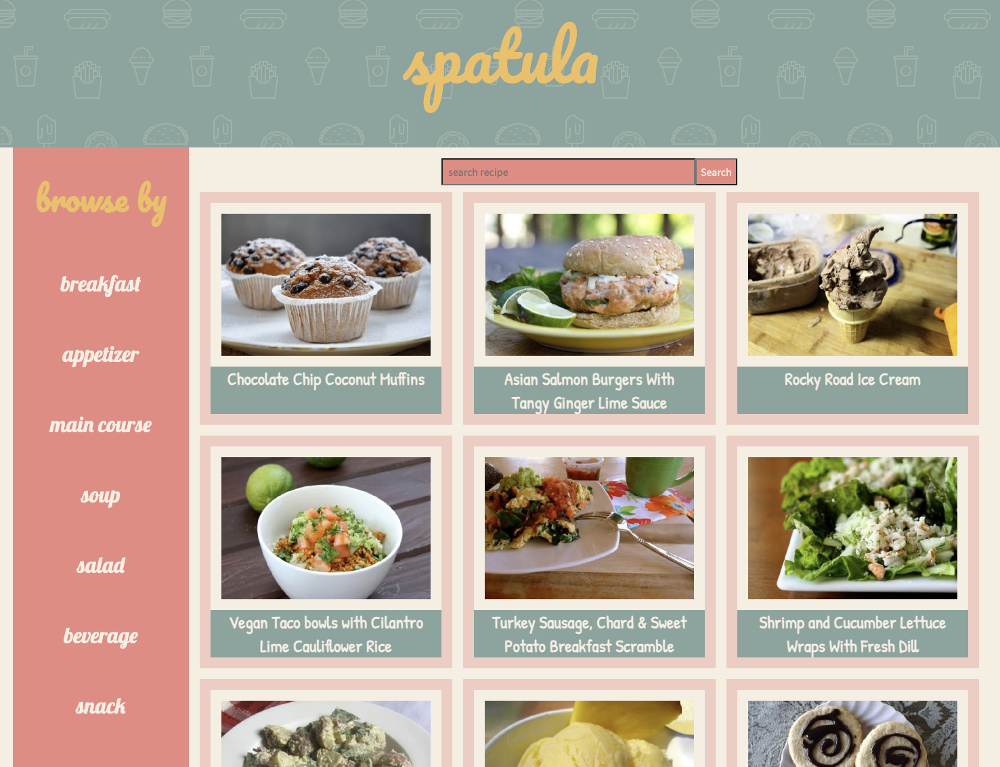
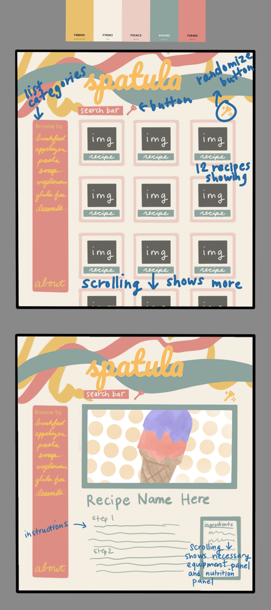

## spatula app

Description:
spatula is an app designed to look up recipes that return the user back a list of recipes with their images and descriptions. Users can then click on the image to check the instructions, ingredients and equipment necessary, and nutrition facts of the recipe. I wanted to create this app since I enjoy cooking, and I often have trouble deciding what to cook. The app is using api data from [spoonacular](https://spoonacular.com/food-api).



## List of Technologies used:

1. React JS
2. CSS
3. ProCreate

## Installation Instruction:

Access at: https://spatula-recipes.netlify.app/
If you would like to fork and clone this app, please follow the steps below:

1. Access at https://github.com/caterada/spatula
2. Fork the repository
3. Go to your terminal and cd into the folder you would like to clone the project directory into
4. Copy the SSH code and enter the following in your terminal:

```bash
git clone (SSH code here)
```

5. Create a new branch "git checkout -b (branch name here)"
6. Install react by entering:

```bash
npx create-react-app .
```

7. Run "npm run start"

## User stories:

AAU = As a user...

- AAU, I want to search for recipes with a keyword, so when I need inspiration on what to cook, I can find it online.
- AAU, I want to see a preview of the recipe photo so that I can have a visual understanding of the final result.
- AAU, I want to click on an individual recipe photo so that it can take me to a detailed view of the recipe.
- AAU, I want to be able to browse recipes by set categories by clicking on the text so I can use the links when I don't want to think of a search word myself.
- AAU, I want to see the instructions of the recipe so I can follow it.
- AAU, I want to see the equipments needed for the recipe so I can determine if I have everything available before reading through the recipe.
- AAU, I want to see the Nutritional information of the recipe so I can see how healthy or unhealthy the recipe is when I need to.

## Wireframes:



## Major hurdles:

1. Setting state in the correct components
2. CSS for the image results, namely the frames
3. Getting equipment data to render
4. Mapping out instructions correctly

## Contribution Guidelines

For all questions, comments, or contributions to the project, please feel free to open a new issue on the github which can be found [here](https://github.com/caterada/spatula/issues).

## Credits

Favicon credit: [icons created by Freepik - Flaticon](https://www.flaticon.com/free-icons/spatula)
